# 📊 Excel-19


## ✨ Project Description

**Excel-19** is a comprehensive guide to advanced What-If Analysis features in Microsoft Excel. It covers Scenarios, Goal Seek, Data Tables, and solving quadratic equations with practical tips, clear explanations, and illustrated examples.

> 📚 **Goal:** Help you master scenario planning and analysis in Excel—useful for students, professionals, and anyone working with data!

---

## 📒 Table of Contents

- [What-If Analysis](#-what-if-analysis)
- [Different Scenarios](#-different-scenarios)
- [Scenario Summary](#-scenario-summary)
- [Goal Seek](#-goal-seek)
- [Data Tables](#-data-tables)
- [Two Variable Data Table](#-two-variable-data-table)
- [Goal Seek Example](#-goal-seek-example)
- [Solve a Quadratic Equation](#-solve-a-quadratic-equation)
- [Screenshots](#-screenshots)
- [Requirements](#-requirements)
- [Author](#-author)

---

## 📈 What-If Analysis

What-If Analysis in Excel lets you quickly test out different scenarios for formulas.

Suppose you own a bookstore with 100 books. You sell a certain % for the highest price of $50, and the rest for $20.

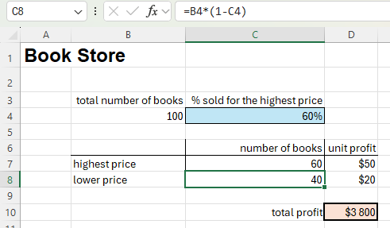

If you sell 60% for the highest price, cell D10 calculates a total profit:
```
60 × $50 + 40 × $20 = $3800
```

---

## 🔀 Different Scenarios

But what if you sell 70%, 80%, 90%, or 100% for the highest price? Each percentage is a different scenario.  
You can use the **Scenario Manager**:

1. Go to **Data** tab → **Forecast** group → **What-If Analysis**.
2. Click **Scenario Manager**.

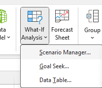

3. Add a scenario (e.g., "60% highest"), select cell C4 for "Changing cells," and click OK.

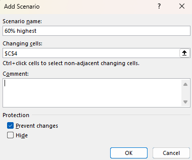

4. Enter value `0.6` and click OK.

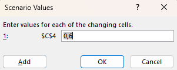

5. Repeat for 70%, 80%, 90%, and 100%.

Your Scenario Manager should look like:

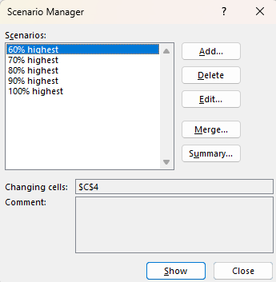

> 📝 **Tip:** To see a scenario's result, select it and click **Show**.

---

## 📝 Scenario Summary

To compare scenario outcomes:

1. Click **Summary** in Scenario Manager.
2. Select cell D10 (total profit) as the result cell, then click OK.

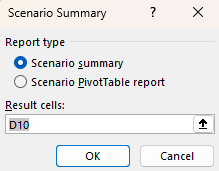

**Result:**

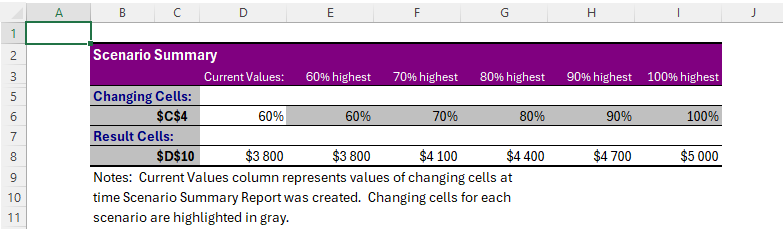

---

## 🎯 Goal Seek

Use Excel's Goal Seek to find out how many books you need to sell at the highest price for a specific profit.

For example, to reach a profit of $4700:

1. Go to **Data** tab → **Forecast** group → **What-If Analysis**.
2. Click **Goal Seek**.

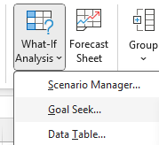

3. Set cell D10 as the target.
4. Enter `4700` for "To value".
5. Change cell C4.

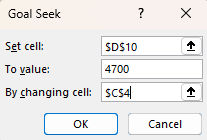

**Result:**

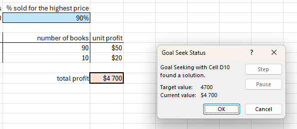

---

## 📊 Data Tables

Instead of separate scenarios, use a Data Table for different input values.

1. Select cell B12 and enter `=D10` (refer to total profit).
2. Input percentages in column A.
3. Select A12:B17.
4. Go to **Data** tab → **Forecast** group → **What-If Analysis**.
5. Click **Data Table**.

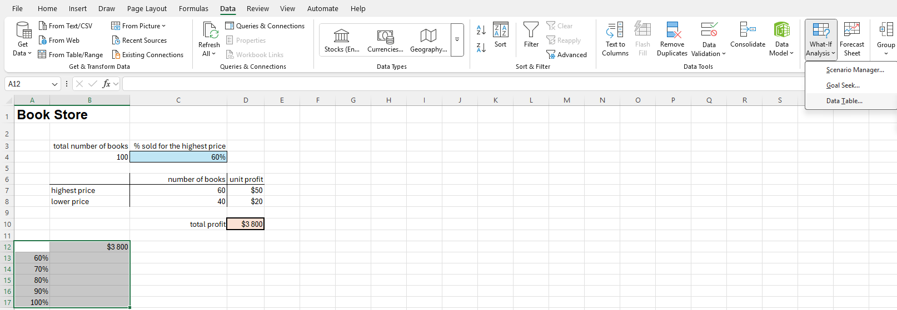

6. Set **Column input cell** to C4.

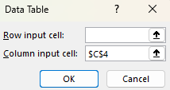

> ℹ️ **Note:** For a one-variable data table, leave Row input cell blank.

**Result:**

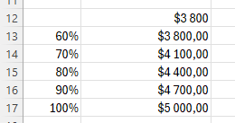

---

## 🧮 Two Variable Data Table

1. Enter `=D10` in A12.
2. Input unit profits in row 12.
3. Input percentages in column A.
4. Select A12:D17.
5. Go to **Data** tab → **Forecast** group → **What-If Analysis**.
6. Click **Data Table**.
7. Set **Row input cell** to D7 and **Column input cell** to C4.

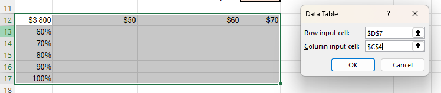

**Result:**

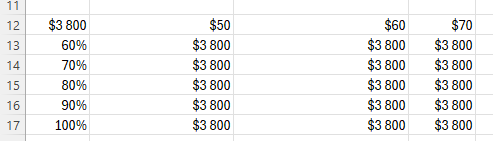

---

## 🎓 Goal Seek Example

Find the required grade on the 4th exam for a final grade of 70.

1. B7 contains the formula for the final grade.

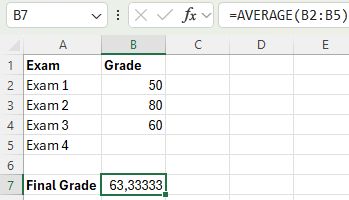

2. B5 (grade for the 4th exam) is the input.
3. Go to **Data** tab → **Forecast** group → **What-If Analysis**.
4. Click **Goal Seek**.
5. Set cell B7 to `70`, changing cell B5.

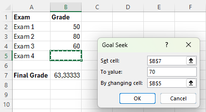

**Result:** A grade of 90 on the fourth exam gives a final grade of 70.

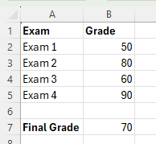

---

## 📐 Solve a Quadratic Equation

A quadratic equation: `ax^2 + bx + c = 0` where a ≠ 0.

Example: `y = 3x^2 - 12x + 9.5`  
Calculate y for x = 2:  
`y = -2.5`

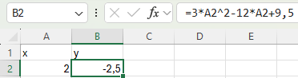

To find x for a given y (e.g., y = 24.5):

1. Click **Goal Seek**.
2. Set cell B2 to `24.5`, changing cell A2.

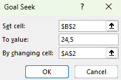

**Result:**

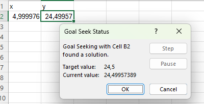

---

## 📷 Screenshots

All screenshots referenced above can be found in the `/Screenshots` folder.

---

## ℹ️ Requirements

- Microsoft Excel (recommended: 2021/365 for best experience)
- Windows OS recommended

---

## 👨‍💻 Author

Project and documentation by **Kuba27x**  
Repository: [Kuba27x/Excel-19](https://github.com/Kuba27x/Excel-19)

---
